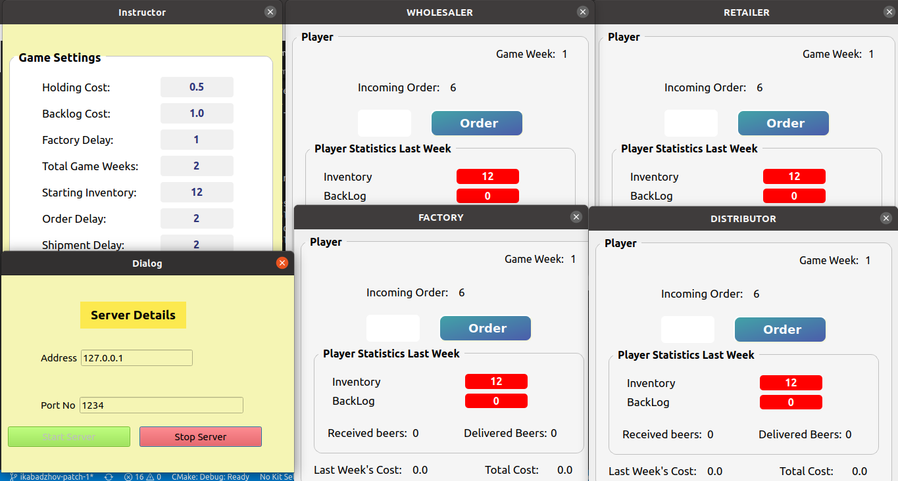

# se-05-team-02


[](https://GitHub.com/Naereen/StrapDown.js/releases/)


#   Beer Game 🍻

## Table of Contents

* [About the Project](#about-the-project)
    * [Built with](#built-with)
      * [Packages to check test coverage](#packages-to-check-test-coverage)
    * [Submitted by](#submitted-by)
* [Sprint 5 Accomplishments](#sprint-5-accomplishments)
* [Getting Started](#getting-started)
    * [Installation](#installation)
    * [Run the app](#run-the-app)
    * [Run the tests](#run-the-tests)
* [Current UI Guide](#current-ui-guide)
  * [Screenshot of running game mode](#screenshot-of-running-game-mode)
* [Contributing](#contributing)
* [Acknowledgements](#acknowledgements)

## About the Project

The beer game is an online game intended for students to better understand how supply chain works in a real world situation, applying the theory learned in class and practicing decision making. Therefore it is a functional type of game. This project simulates the way beer is being ordered and delivered from production and factory, going to distributor, then wholesaler and then to retailer and consumer. Each of these stages can be played by the students who, order enough beer stock in the position they hold, taking into consideration shipment times, delays, backorders, inventory such that, every partner in this chain doesn’t suffer any losses.

### Built with
* [C++](http://www.cplusplus.com)
* [Qt Creator](https://www.qt.io/download)
* [CMake](https://cmake.org/cmake-tutorial)
* [Doxygen](http://www.doxygen.nl/manual/starting.html)
* [Google Test](https://github.com/janoszen/clion-project-stub/blob/master/gtests/googletest/docs/Primer.md)

#### Packages to check test coverage

* [Lcov](http://ltp.sourceforge.net/coverage/lcov.php)
* [Genhtml](https://linux.die.net/man/1/genhtml)


### Submitted by: 

[**Drishti Maharjan**](https://github.com/ohwhatafool) - d.maharjan@jacobs-university.de <br/>
[**Ivan Kabadzhov**](https://github.com/ikabadzhov) - i.kabadzhov@jacobs-university.de

## Sprint 5 Accomplishments:

### Improvements in given codebase:

- [X] Fixed existing bugs in GUI, and restructured GUI
- [X] Re-factored most of back-end code functionality which was previously incomplete/buggy
- [X] Generated documentation in build folder, and improved documentation
- [X] Added more testing, increased backend test coverage significantly
- [X] Removed use of all global variables
- [X] Added references and detailed README Guide

### New Features Added:

- [X] Implemented client-server (1 server: 4 clients) for TCP socket communication with NoProxy
- [X] Connected socket with existing frontend and backend (instructor -> server, players -> clients)
- [X] Instructor customization of game parameters connected with players game parameters
- [X] Implemented 4-player game mode, with "no duplicate role allowed" feature
- [X] Added validation check for all input fields in GUI
- [X] Added interactive buttons to allow start/stop/exit functionality

## Getting started

These instructions will get you a copy of the project up and running on your local machine for development and testing purposes. What things you need to install the software:

### Prerequisites
* Qt5 SDK

* GTest

### Installation
Clone the repo
```sh
git clone https://github.com/iuliacornea99/se-03-team-29
```

### Run the app
```sh
mkdir build
cd build
cmake .. -DCMAKE_PREFIX_PATH=$(brew --prefix qt5)
make
./src/beergame
```

### Run the tests
```sh
cd build
cmake .. -DCMAKE_PREFIX_PATH=$(brew --prefix qt5)
make
./tests/beergame-test
```

You have to set your Qt location in CMakeLists if it doesn't work via set(CMAKE_PREFIX_PATH PATH_TO_QT)

and to see the generated docs after running make, check directory `build/doc/html`, and open `index.html` in web broswer.


### Check Test Coverage

Current `CMakeLists.Txt` (in outermost directory) has test coverage enabled. So, after you compile and run the executable `build/test/beergame-tests` , type these commands in build directory:

```
lcov --capture --directory . --output-file cov.info
genhtml cov.info -o html
cd html
```

Then, you can see the generated test coverage report inside `build/html`. Open `index.html` in a browser to check the report.


## Current UI Guide

To play the game, follow this guide step by step:

### 1. Login as Instructor: 

* Credentials For Instructor:

  ```
  User Email : test
  Password   : 1234
  Instructor : ✅ (True)
  ```

### 2. Set Game Settings:

* Set your game parameters. If you want to use default values, click on 'Reset Defaults'. All your parameters should be valid according to game rule, or you will get warning messages. 
* Click on 'Create Game Server'
* Set your local host address and any port you wish to listen to.
* Click on 'Start Server'. Meanwhile, run another 4 executables (for Players) as instructed below.
* If you click on 'Stop Server', all server connections will closed, and you have to restart the executable to connect to a server. So, don't click stop until you are finished with the game.

### 3. Player Login:

* Credentials For Player:

  ```
  User Email : player
  Password   : 1234
  Player     : ✅ (True)
  ```

### 3. Player connect to server

* In order to join the game created by the instructor, set up the same address and port as created by the instructor. 
* Click on 'Request Connection'
* Click on any role you want to play. You can't start the game unless 4 players have joined the game server. So, do the same for other 3 players.
* No duplicate role is allowed. After 4 unique role players have joined, all players will be directed to game screen.

### 4. Game-play

* Enter orders (valid input: positive integer) of players in any order.
* You can't send another order until all players have sent orders for the current round
* After all rounds end, all players get the "Game Over" message and the server-clients are disconnected.
* Make Sure you don't disconnect from the server and any of the player doesn't leave the game in between. This is a 4 player mode game, so if any of the players/ server disconnects, game connection is closed.

### 5. Multiple game sessions

* 4 players can play the game at one server. For multiple games, follow the steps above (1-4) with a different server (host and port) as different executables.

### Screenshot of running game mode



## Contributing

Contributions are what make the open source community such an amazing place to learn, inspire, and create. Any contributions you make are **greatly appreciated**.

1. Fork the Project
2. Create your Feature Branch (`git checkout -b feature/Feature_Name`)
3. Commit your Changes (`git commit -m 'Add some Feature_Name`)
4. Push to the Branch (`git push origin feature/Feature_Name`)
5. Open a Pull Request

### Potential Areas to Contribute

While there could be many areas where you could contribute, some of the potential areas to improve the game functionality could be:

- [ ] Adding computer players to run the game when there are not enough human players in the game
- [ ] Connecting log-in/sign-up features with databases
- [ ] More customization for the instructor, for e.g., with demand model

## Acknowledgements

1. Course Instructor: Prof. Peter Baumann
2. Course TAs: Rahul Shrestha, Iulia Cornea
3. Initial game guidance, IEM Instructor: Prof Stanislav Chankhov
4. Students who contributed in team 2 for all sprints
